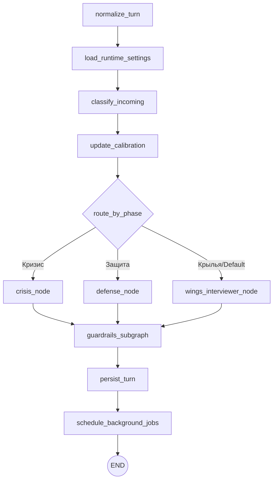

# LangGraph Архитектура: Pitch Wow

В этом документе описана структура LangGraph, используемая в агенте «Бабур» для проекта Pitch Wow.

## 1. Состояние (PitchWowState)

Состояние (`PitchWowState`) — это структура данных (`TypedDict`), которая передается между нодами. Оно хранит всю информацию о текущей сессии.

| Поле | Тип | Описание |
| :--- | :--- | :--- |
| `session_id` | `str` | Уникальный идентификатор сессии. |
| `messages` | `list[Message]` | История сообщений (роль, контент, источник). |
| `phase` | `Phase` | Текущая фаза диалога: `"unknown"`, `"Защита"`, `"Кризис"`, `"Крылья"`. |
| `phase_confidence` | `float` | Уверенность в определении фазы (0.0 - 1.0). |
| `personality_dev_level` | `PersonalityLevel` | Уровень развития личности: `"личность"`, `"бизнес"`, `"синергия"`. |
| `repeated_question_count` | `int` | Счетчик повторных вопросов (для выявления "Защиты"). |
| `macro_pattern_count` | `int` | Счетчик макро-паттернов (говорит ли пользователь о рынке/трендах вместо личного). |
| `pending_response` | `str | None` | Сырой ответ от LLM перед проверкой охранителями (guardrails). |
| `validated_response` | `str | None` | Финальный ответ, прошедший все проверки. |
| `guardrail_retries` | `int` | Количество попыток переписывания ответа через LLM. |
| `outcome` | `Outcome | None` | Итог сессии: `"completed"`, `"short-session"`, `"crisis-walk-away"`. |
| `next_node_hypothesis` | `str | None` | Гипотеза следующего узла для кросс-продаж (`"Беруни"`, `"Навои"`, `"Улугбек"`). |

## 2. Ноды (Nodes)

Ноды — это асинхронные функции, которые обрабатывают состояние и выполняют логику агента.

### Основные этапы обработки
1. **`normalize_turn`**: Точка входа. Инициализирует обработку нового сообщения.
2. **`load_runtime_settings`**: Загружает системный промпт "babur.system" из базы данных, позволяя менять поведение агента «на лету».
3. **`classify_incoming`**: Вызывает классификатор LLM для анализа последних сообщений. Определяет сигналы кризиса, защиты или готовности к развитию ("Крылья").

### Калибровка (calibration.py)
4. **`update_calibration`**: 
   - **Кризис**: Имеет высший приоритет. Если обнаружен, фаза не переопределяется.
   - **Защита**: Если пользователь задал одинаковый вопрос дважды, переводит сессию в фазу "Защита".
   - **Макро-паттерны**: Если пользователь отвечает общими фразами (рынок, статистика), увеличивает счетчик для использования техники "зеркало-ставка".
   - **Крылья**: Если после 3+ сообщений фаза все еще "unknown", автоматически переводит в "Крылья".

### Узлы принятия решений (Фазы)
5. **`crisis_node`**: 
   - **Правило**: Активируется при `phase == "Кризис"`.
   - **Действие**: Отправляет сообщение поддержки и предлагает вернуться к продукту позже. Завершает сессию (`outcome = "crisis-walk-away"`).
6. **`defense_node`**: 
   - **Правило**: Активируется при `phase == "Защита"`.
   - **Действие**: Предлагает сохранить рамку и задает финальный вопрос для размышления. Завершает сессию (`outcome = "short-session"`).
7. **`wings_interviewer_node`**: 
   - **Правило**: Основной узел интервью.
   - **Действие**: 
     - Если это первое сообщение — выдает приветственное представление "Бабура".
     - Если обнаружены макро-паттерны (`macro_pattern_count >= 2`) — использует технику "mirror-and-bid" (указывает на паттерн и просит подтвердить).
     - В ином случае — генерирует ответ через основную модель Claude.

### Охранители и финализация (Guardrails & Post-processing)
8. **`guardrails_subgraph`**: Проверяет `pending_response` на соответствие жестким правилам:
   - **Запрет "не"**: Founder не должен использовать частицу "не". Если найдена — вызывает LLM-переписыватель.
   - **Проверка области (Scope)**: Запрет на упоминание других персон (Авиценна, Томирис) в первом сообщении.
   - **Безопасность кризиса**: Финальная проверка на безопасность ответа, если сессия в фазе "Кризис".
9. **`persist_turn`**: Сохраняет текущий виток диалога в базу данных (PostgreSQL).
10. **`schedule_background_jobs`**: 
    - Запускает фоновую задачу "Cartographer" после 5+ сообщений пользователя.
    - Если сессия завершена и есть готовность к кросс-продаже (`cross_sell_readiness == "ready"`), добавляет в конец ответа рекомендацию одного из узлов (Беруни/Навои/Улугбек).

## 3. Правила переходов (Graph Flow)

Граф выстраивается в функцию `build_graph()` и компилируется с использованием `PostgresSaver` для сохранения чекпоинтов в PostgreSQL.

### Поток выполнения:

### Ключевые особенности переходов:
*   **Линейный старт**: Каждый новый виток начинается с нормализации, загрузки настроек и классификации сигналов.
*   **Условная маршрутизация (`route_by_phase`)**: На основе состояния `phase` граф выбирает один из трех путей (Кризис, Защита или Крылья).
*   **Обязательная валидация**: Все три ветки фаз обязательно сходятся в ноде `guardrails_subgraph` перед отправкой ответа пользователю в Telegram.
